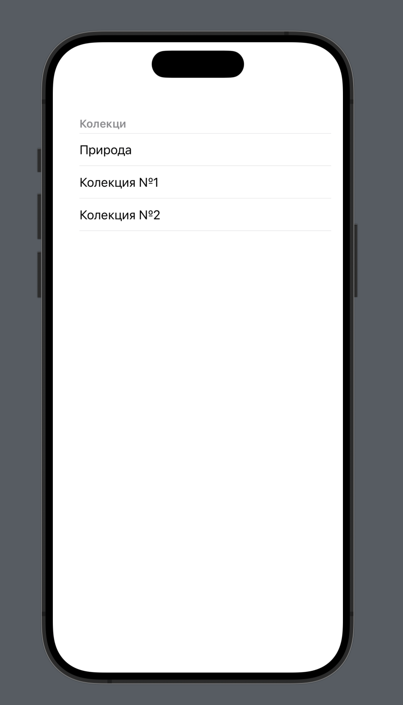

#  Задание - Видео Колекция

Започвате от проекта, който се намира в текущата директория.
В него имате дадени помощни средства, които ще ви помогнат при
реализирането на решението.

Трябва да реализирате следните функционалности:
1. Да се визуализира списък от видео колекции в `SwiftUI`. 
    > Ако нямате iOS 17, тогава използвайте други познати средства.
    > за целта ползвайте `HomeView`
    * Използвайте иконата и текста, за да покажете всички елементи
    > Моделът, предоставя необходимите данни.

Пример:

2. При избор на видео колекция от списъка да се показва нов екран с всички видеа в конкретната колекция.
    > за целта ползвай `CollectionView`
    > Всяко видео има заглавие, малка картинка и прогрес (до къде е изгледано). Представете това по подходящ начин, в списъка. (Може да взаимствате идеи от youtube.com или netflix)
3. Всяко видео да може да се отваря е отделен екран.
    > Виж `VideoView`
4. Да се запазват прогреса при гледане на видео. Т.е. състоянието на всеки видео запис да е "устойчиво" при разглеждане на няколко различни видеа.

Време за работа: __120__ min

Начин на предаване на решението:
- Качване на линк, който ще е обявен по време на упражнението.

